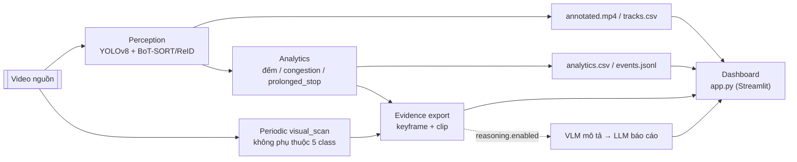

# Kiến trúc pipeline — tổng hợp tham chiếu

**Trạng thái:** Tài liệu tham chiếu (reference), không phải kế hoạch.
**Ngày cập nhật:** 2026-09-04
**Phạm vi:** Toàn bộ pipeline runtime (video → detect/track → analytics →
evidence → VLM/LLM → dashboard), không bao gồm training detector hay mô
phỏng SUMO — hai nhánh đó được tóm tắt ngắn ở mục 7, chi tiết xem
[docs/quickstart.md](../docs/quickstart.md) và
[ke-hoach-pipeline-va-mo-phong.md](ke-hoach-pipeline-va-mo-phong.md).

Tài liệu này mô tả **hiện trạng code**, không phải hướng phát triển. Với
quyết định thiết kế (tại sao chọn hướng này, đã đo được gì, còn giới hạn
gì), xem [readme.md](../readme.md), đặc biệt mục "Anomaly detection:
measured scope" và "Known limitations" — tài liệu này không lặp lại nội
dung đó.

---

## 1. Ba cách chạy pipeline

| Cách chạy | Entry point | Làm gì |
|---|---|---|
| Chỉ detect | `scripts/detect.py` | 1 lượt YOLO trên ảnh/thư mục/video, không tracking, không analytics, không VLM/LLM. |
| Pipeline không VLM/LLM | `run_pipeline.py` (`vn_traffic.cli:main`), `reasoning.enabled: false` (mặc định) | detect + track (BoT-SORT/ReID) + analytics (đếm, congestion state, prolonged_stop) + evidence export. |
| Full pipeline | `run_pipeline.py` với `reasoning.enabled: true` trong config | Như trên, cộng thêm VLM mô tả. `scope: traffic_window` (khuyến nghị cho mô tả thường kỳ; mặc định code là `event`): mô tả cả video theo cửa sổ thời gian cố định, ghi `traffic_windows.jsonl` (~29s đo được trên clip demo 22s). `scope: event`: mô tả từng trigger `visual_scan`/`congestion_transition`/`prolonged_stop` + LLM viết báo cáo, ghi `reasoning.jsonl` (chậm hơn nhiều — tới hàng chục phút cùng clip, do gọi VLM lặp lại cho các event trùng cảnh). |

Ba cách này dùng chung một `PipelineRunner` — khác nhau ở config, không phải
ở code path riêng biệt (trừ `detect.py`, hoàn toàn độc lập).

---

## 2. Sơ đồ khối tổng quan



---

## 3. Sơ đồ khối chi tiết (toàn bộ module)

```mermaid
flowchart TD
    subgraph INPUT["Nguồn & cấu hình"]
        VIDEO[["Video nguồn (datasets/*.mp4)"]]
        CFG["configs/pipeline/*.yaml\n→ PipelineConfig (config.py)"]
        MANIFEST["manifests/measurement/*.yaml\n(tuỳ chọn — measurement_manifest.py)\nGate G1: vắng mặt KHÔNG được làm fail pipeline"]
    end

    CFG --> LOOP
    MANIFEST -.->|optional| LOOP

    subgraph LOOP["PipelineRunner.run() — runner.py — vòng lặp mỗi frame"]
        direction TB
        DECODE["cv2.VideoCapture.read()"]
        PERCEPT["UltralyticsPerception.process()\nperception.py — model.track(persist=True)"]
        TRACKROWS["ghi từng TrackObservation\n→ tracks.csv (flush mỗi frame)"]
        ANALYTICS_CALL["TrafficAnalytics.process()\nanalytics/engine.py — nếu analytics.enabled"]
        EVENTSJSONL["events.jsonl\n(line_crossing / prolonged_stop /\ncongestion_transition / perception_status_change /
        visual_scan routing trigger)"]
        ANALYTICSCSV["analytics.csv\n(1 AnalyticsSnapshot / frame)"]
        OVERLAY_CALL["AnalyticsOverlay.draw()\nanalytics/overlay.py"]
        HEATMAP_CALL["StillnessHeatmapRenderer.render()\nanalytics/stillness.py\n(tuỳ chọn — stillness_heatmap.enabled)"]
        FRAMESTATS["draw_frame_stats()\nframe / fps / vehicle count (luôn bật)"]
        WRITEVIDEO["cv2.VideoWriter → annotated.mp4\n(chỉ playable SAU khi run xong)"]
        LATESTFRAME["latest_frame.jpg\nghi file .tmp rồi rename nguyên tử —\nview 'live' thật sự cho dashboard"]
        RUNJSON["run.json\nprovenance (git/env/hash) + progress,\nghi lại mỗi ~1s qua write_json_atomic()"]
    end

    VIDEO --> DECODE --> PERCEPT
    PERCEPT -->|BoT-SORT+ReID, per-track\nclass-vote smoothing| TRACKROWS
    PERCEPT --> ANALYTICS_CALL
    ANALYTICS_CALL --> EVENTSJSONL
    ANALYTICS_CALL --> ANALYTICSCSV
    ANALYTICS_CALL -->|nếu có snapshot| OVERLAY_CALL
    OVERLAY_CALL --> HEATMAP_CALL --> FRAMESTATS
    FRAMESTATS --> WRITEVIDEO
    FRAMESTATS --> LATESTFRAME
    DECODE -.->|mỗi ~1s| RUNJSON

    subgraph ANALYTICS_DETAIL["Bên trong TrafficAnalytics (engine.py)"]
        direction TB
        GEOM["geometry.py\nto_pixels / point_in_polygon /\nstable_line_side / segments_intersect"]
        OCC["occupancy.py\nBBoxUnionOccupancy — rasterize bbox\ntrong ROI thành lưới pixel"]
        STATE["state.py\nCongestionStateMachine\nNORMAL→DENSE→CONGESTED, có hysteresis\n(transition_confirm_s / release_confirm_s)"]
        STOP["stop_drift_body_lengths()\nprolonged_stop: trôi tâm track qua cửa sổ\nmin_duration_s, chuẩn hoá theo chiều cao bbox\n(KHÔNG dùng tốc độ tức thời)"]
        GMC["motion.py\nGlobalMotionCompensator (ECC)\nchỉ khi analytics.mode=uav_motion\n+ gmc_enabled — tái chiếu ROI/line theo camera pan/zoom"]
        STILL["stillness.py\nStillnessTracker — optical flow (Farneback)\n+ texture, tín hiệu độc lập với detector\nchỉ khi stillness_enabled"]
    end
    ANALYTICS_CALL --> GEOM & OCC & STATE & STOP
    ANALYTICS_CALL -.->|gmc_enabled| GMC
    ANALYTICS_CALL -.->|stillness_enabled| STILL
    GMC -.->|warp_points| GEOM
    STILL -.->|stalled_dense_fraction| STATE

    EVENTSJSONL --> EVIDENCE_GATE{"evidence.enabled?"}
    EVIDENCE_GATE -->|false| NOEVIDENCE["NoEvidence — ghi evidence.jsonl rỗng"]
    EVIDENCE_GATE -->|true| EVIDENCE

    subgraph EVIDENCE["EventEvidenceExporter.export() — evidence.py\n(pass 2: mở lại & decode tuần tự SAU KHI frame loop xong)"]
        direction TB
        SELECT["lọc event có event_type ∈\nkeyframe_event_types ∪ clip_event_types"]
        KEYFRAME["evidence/frames/*.jpg\nkeyframe (+ roi_crop / event_crop\nnếu multi_view_enabled)"]
        CLIP["evidence/clips/*.mp4\n[frame_index − pre_event_s·fps,\n frame_index + post_event_s·fps]"]
        EVIDENCEJSONL["evidence.jsonl\n(mỗi record: path + sha256 + kích thước\n+ raw_bgr_sha256 cho từng ảnh)"]
    end
    SELECT --> KEYFRAME --> EVIDENCEJSONL
    SELECT --> CLIP --> EVIDENCEJSONL

    ANALYTICS_CALL --> SUMMARY["TrafficAnalytics.summary()\n→ summary.json (claim_boundary tường minh)"]

    EVIDENCEJSONL --> REASONING_GATE{"reasoning.enabled?\n(ReasoningConfig, config.py)"}

    REASONING_GATE -->|true — TỰ ĐỘNG trong cli.py\nngay sau khi PipelineRunner.run() xong| STAGE
    subgraph STAGE["pipeline_stage.run_reasoning_stage() — MỚI, tích hợp trực tiếp"]
        direction TB
        BUILDCASE["build_cases(run_dir, event_types)\nnối events.jsonl ⋈ evidence.jsonl theo event_id,\nmặc định event_types = {visual_scan, congestion_transition, prolonged_stop}\n(line_crossing bị loại — quá nhiều, không cần mô tả)"]
        VLMLOAD["load_vlm() — load 1 LẦN\nQwen3-VL-2B-Instruct (transformers, fp16, CUDA)"]
        VLMLOOP["run_vlm_case() × N case\n— tái dùng processor/model, không load lại"]
        UNLOAD["giải phóng VLM: del model,processor\n+ torch.cuda.empty_cache()\n(trước khi load LLM — ngân sách 6GB VRAM)"]
        LLMLOOP["load_llm() 1 lần + run_llm_case() × N\nQwen3-0.6B (llm_runtime.py)"]
        REASONINGJSONL["reasoning.jsonl\n{case_id, event_id, event_type, vlm, llm}"]
    end
    BUILDCASE --> VLMLOAD --> VLMLOOP --> UNLOAD --> LLMLOOP --> REASONINGJSONL

    REASONING_GATE -->|false (mặc định)| DONE_NOREASON(["hết — không có bước VLM/LLM"])

    subgraph FROZEN["Đường song song, độc lập: frozen development case\n(dùng cho calibration/audit, KHÔNG chạy tự động trong pipeline)"]
        direction TB
        FREEZE["freeze_evidence_set.py\nkhoá 1 tập evidence cụ thể theo hash\n→ manifests/reasoning/<set>/input_lock.json"]
        RUNVLM["scripts/reasoning/run_vlm.py\n--config ... --case-id ... --model-dir ...\n→ output/reasoning/<case>-vlm.json"]
        RUNLLM["scripts/reasoning/run_llm.py\n--vlm-result <vlm.json> --model-dir ...\n→ output/reasoning/<case>-llm.json"]
        ANNOT["annotations.py\n2-reviewer annotation workflow\ntrên evidence đã khoá (đánh giá chất lượng thủ công)"]
    end
    EVIDENCEJSONL -.->|freeze_evidence_set.py| FREEZE
    FREEZE --> RUNVLM --> RUNLLM
    FREEZE -.-> ANNOT

    subgraph CONTRACTS["reasoning/contracts.py — validate MỌI I/O VLM/LLM\n(cả 2 đường trên đều đi qua đây)"]
        direction TB
        C1["build_vlm_request / validate_vlm_request\n(event + evidence → request JSON đóng băng)"]
        C2["validate_vlm_assessment\nevidence_refs phải khớp evidence thật;\nvalidate_grounding_policy chặn tuyên bố\nchuyển động khi chỉ có keyframe tĩnh"]
        C3["build_llm_request / validate_llm_request"]
        C4["assemble_llm_report / validate_llm_report\n(llm_runtime.py) — numeric_facts + action.level LUÔN do code\nquyết định, KHÔNG do model sinh ra"]
    end
    VLMLOOP -.-> CONTRACTS
    LLMLOOP -.-> CONTRACTS
    RUNVLM -.-> CONTRACTS
    RUNLLM -.-> CONTRACTS

    RUNJSON --> DASHBOARD
    LATESTFRAME --> DASHBOARD
    ANALYTICSCSV --> DASHBOARD
    EVENTSJSONL --> DASHBOARD
    subgraph DASHBOARD["app.py — Streamlit dashboard (đọc run_dir đã/đang ghi)"]
        direction TB
        POLL["list_run_dirs() — chọn run mới nhất\npoll run.json + latest_frame.jpg mỗi refresh"]
        VIEW["frame trực tiếp, trạng thái congestion,\ntimeline occupancy/track-count, event log,\nannotated.mp4 (chỉ sau khi run xong)"]
    end
    POLL --> VIEW
```

---

## 4. Chi tiết từng module

### 4.1. Config (`src/vn_traffic/config.py`)

`load_pipeline_config(path)` đọc 1 file YAML, trả về `PipelineConfig` —
dataclass frozen, validate ngay khi load (`validate_pipeline_config`). Các
section con:

| Dataclass | Field `enabled` mặc định | Điều khiển |
|---|---|---|
| `AnalyticsConfig` | `enabled=True` | ROI/counting line, congestion thresholds, `prolonged_stop_enabled=False`, `gmc_enabled=False`, `stillness_enabled=False` |
| `EvidenceConfig` | `enabled=False` | keyframe/clip event types, pre/post_event_s, `multi_view_enabled=False` |
| `StillnessHeatmapConfig` | `enabled=False` | overlay tô màu vùng "dày đặc + gần như đứng yên" — chỉ hiển thị, không tự động cảnh báo |
| `ReasoningConfig` | `enabled=False` | **mới** — bật VLM/LLM tích hợp thẳng vào `run_pipeline.py`, xem 4.6 |

`with_overrides()` cho phép CLI override `--source/--model/--max-frames/
--device/--imgsz` mà không sửa YAML, validate lại sau mỗi override.

### 4.2. Perception (`src/vn_traffic/perception.py`)

`UltralyticsPerception` sở hữu đúng 1 instance `ultralytics.YOLO`, dùng cho
cả detect lẫn track (`model.track(persist=True, tracker=...)`) — tracker
mặc định `botsort_reid_lowprox.yaml` (BoT-SORT + ReID). `imgsz`/`line_width`
mặc định `None` → tự thích ứng theo độ phân giải nguồn
(`sizing.adaptive_imgsz`/`adaptive_line_width`), không cố định một giá trị
tuned cho 1 video.

Có 1 cơ chế làm mượt nhãn lớp theo track: mỗi `track_id` giữ
`Counter[class_id]` phiếu bầu, nhãn hiển thị/ghi ra là lớp đa số tích luỹ
— chống nhấp nháy nhãn (1 frame lẻ đoán nhầm "car" giữa chuỗi "truck")
mà không đụng vào logic identity/motion của tracker.

### 4.3. Orchestration (`src/vn_traffic/runner.py`)

`PipelineRunner.run()` là vòng lặp chính, theo thứ tự mỗi frame: decode →
`perception.process()` → ghi `tracks.csv` → `event_processor.process()`
(analytics, có thể `NoEvents` nếu tắt) → ghi `events.jsonl`/`analytics.csv`
→ `overlay_renderer.draw()` → `heatmap_renderer.render()` (tuỳ chọn) →
`draw_frame_stats()` (luôn bật) → ghi `annotated.mp4` + `latest_frame.jpg`.

Sau khi hết frame (hoặc chạm `max_frames`): `event_processor.summary()` →
`summary.json`, rồi `evidence_exporter.export()` (pass 2, xem 4.5) →
`evidence.jsonl`. `run.json` được ghi nguyên tử (`write_json_atomic`, tự
retry khi Windows khoá file tạm thời) — chứa provenance (git commit, dirty
worktree, sha256 của source/model/config/tracker, phiên bản torch/
ultralytics/CUDA) và tiến độ realtime.

`run.json`, `latest_frame.jpg`, và manifest evidence dùng temp + rename
nguyên tử. `tracks.csv`, `analytics.csv`, và `events.jsonl` được stream/flush
mỗi frame để dashboard đọc tiến độ; chúng có thể kết thúc dở nếu process bị
kill đột ngột.

### 4.4. Analytics (`src/vn_traffic/analytics/`)

`TrafficAnalytics.process()` (engine.py) là nơi tổng hợp tất cả:

- **Đếm & line-crossing**: theo dõi `stable_line_side` của từng track quanh
  `counting_line`, xác nhận cắt vạch bằng `segments_intersect` giữa điểm ổn
  định gần nhất và điểm hiện tại (không phải chỉ đổi dấu khoảng cách, để
  chống nhiễu quanh vạch).
- **Occupancy**: `BBoxUnionOccupancy` (occupancy.py) rasterize hợp các bbox
  trong ROI lên lưới pixel, đo tỉ lệ phủ — không phải tổng diện tích bbox
  (tránh đếm trùng khi bbox chồng nhau).
- **Congestion state machine**: `CongestionStateMachine` (state.py),
  NORMAL/DENSE/CONGESTED, có ngưỡng enter/exit riêng + xác nhận theo thời
  gian (`transition_confirm_s`/`release_confirm_s`) để chống rung trạng
  thái. `analytics.mode: uav_motion` bỏ yêu cầu occupancy đồng thời với
  count (occupancy bị pha loãng khi ROI = full frame).
- **`prolonged_stop`**: `stop_drift_body_lengths()` đo độ trôi tâm track
  qua 1 cửa sổ `min_duration_s`, chuẩn hoá theo chiều cao bbox — **không**
  dùng tốc độ tức thời (đã đo: jitter bbox ±1px ở 30fps tạo tốc độ giả
  30px/s, đủ để phá vỡ mọi ngưỡng tốc độ). Cửa sổ trim theo mẫu thứ 2, không
  phải mẫu cũ nhất — off-by-one đã sửa trong session này (xem readme).
- **GMC** (`motion.py`, tuỳ chọn — `analytics.mode: uav_motion` +
  `gmc_enabled: true`): `GlobalMotionCompensator` dùng ECC
  (`cv2.findTransformECC`) ước lượng affine giữa 2 frame liên tiếp, tích
  luỹ về frame 0, tái chiếu ROI/counting_line theo camera pan/zoom. Không
  phải BEV/GPS; mất khoá dưới cắt cảnh/chuyển động nhanh (đóng băng
  transform cuối, không reset về identity).
- **Stillness** (`stillness.py`, tuỳ chọn — `stillness_enabled: true`):
  `StillnessTracker` kết hợp optical flow (Farneback) thấp + texture cao
  theo từng ô lưới → tín hiệu "dày đặc và gần như đứng yên" độc lập hoàn
  toàn với detector, để bù cho trường hợp occlusion nặng khiến detector mất
  hoàn toàn các box (đo trực tiếp ở run37). Chỉ hợp lệ với camera tĩnh
  (`fixed_camera`) — optical flow thô không bù được chuyển động camera.
  `StillnessHeatmapRenderer` (cùng file) là bản overlay hiển thị-only, độc
  lập với state machine, điều khiển bởi `stillness_heatmap.*` riêng.

`AnalyticsOverlay.draw()` (overlay.py) vẽ vạch đếm + text trạng thái lên
frame; **không** vẽ ROI polygon (vẫn áp dụng cho tính toán, chỉ không hiện
trên màn hình). `draw_frame_stats()` là overlay tối thiểu luôn bật (frame
index/fps/vehicle count), độc lập với `analytics.enabled`.

### 4.5. Evidence (`src/vn_traffic/evidence.py`)

`EventEvidenceExporter.export()` chạy **sau** khi vòng lặp chính đã ghi
xong `events.jsonl` — mở lại video và decode tuần tự lần 2 (không giữ toàn
bộ frame trong RAM suốt run). Lọc event có `event_type` nằm trong
`keyframe_event_types` hoặc `clip_event_types`; với mỗi event chọn:

- **keyframe**: JPEG frame đầy đủ tại `frame_index` của event.
- **roi_crop** / **event_crop** (chỉ khi `multi_view_enabled: true`):
  `event_crop` ưu tiên (crop sát + đệm quanh bbox track của chính event
  đó); chỉ fallback về `roi_crop` (crop theo ROI polygon từ measurement
  manifest) khi event không có track bbox khớp — không bao giờ ghi cả hai
  để tránh 2 ảnh gần giống nhau.
- **clip** (chỉ khi event_type ∈ `clip_event_types`): đoạn video
  `[frame_index − pre_event_s·fps, frame_index + post_event_s·fps]`, ghi
  trực tiếp trong lúc decode (không cắt lại từ file đã ghi).

Mọi artifact ảnh có `raw_bgr_sha256` (hash mảng byte BGR đã giải mã, trước
khi nén JPEG) bên cạnh `sha256` (hash file JPEG) — cho phép kiểm tra evidence
chưa bị thay đổi ở cả 2 lớp. `evidence.jsonl` ghi nguyên tử toàn bộ (không
ghi từng dòng dở dang).

### 4.6. Reasoning — VLM/LLM (`src/vn_traffic/reasoning/`)

Ba đường **độc lập**:

**(A) Traffic window — `traffic_window.py` (khuyến nghị cho mô tả thường kỳ trong full
pipeline, mới nhất).** Kích hoạt bằng `reasoning.enabled: true` +
`reasoning.scope: traffic_window`. Chia toàn bộ run thành các cửa sổ thời
gian cố định (`window_seconds`, mặc định 15s) **bất kể có event nào xảy ra
hay không** — khác hẳn cách (B) chỉ mô tả khi có event. Mỗi cửa sổ:
`build_traffic_windows()` tổng hợp số liệu miễn phí từ `analytics.csv` +
`events.jsonl` đã có sẵn (không gọi model) — `vehicle_counts` (đỉnh đồng
thời theo lớp), `occupancy` (trung bình), `stopped_tracks` (số event
`prolonged_stop` rơi trong cửa sổ), `motion_state` (heuristic thô từ tốc
độ trung bình) — rồi lấy 1 frame đại diện tại giữa cửa sổ (decode trực
tiếp từ video nguồn, không qua `EventEvidenceExporter`). VLM chỉ nhận 1
frame + số liệu đã đo (để diễn giải, không tự suy đoán số), sinh JSON tối
giản `{traffic_state, observations[].{claim_vi, evidence_refs},
confidence, limitations}` — **không có `incident_assessment`, không có
tầng LLM thứ hai**. Retry (nếu `max_attempts > 1`) ép chuyển sang
`do_sample=True` — greedy decode retry lại y hệt sẽ ra cùng kết quả, xem
docstring `run_window_vlm()`. Ghi `run_dir/traffic_windows.jsonl`, 1 dòng/
cửa sổ.

**Lý do tồn tại song song với (B):** (B) tạo 1 case/event — với N xe cùng
dừng trong 1 đám ùn tắc thì gọi VLM N lần mô tả gần như cùng 1 cảnh. Đo
được trên video demo 7938 (22.2s): (A) 2 cửa sổ, cả 2 valid ngay lần đầu,
**~29s tổng** (load 14.3s + generate 8.4s + 6.1s); (B) 8 case
`prolonged_stop` (cùng 1 đám ùn tắc), mỗi case tới ~260s/lần sinh 384
token — hàng chục phút. Chênh lệch đến từ số lần gọi model dư thừa, không
phải bug reload/offload (`load_vlm()` dùng `device_map="cuda"` — hard
placement, sẽ OOM chứ không âm thầm offload nếu không vừa; model đã load 1
lần và tái dùng ở cả 2 đường).

**(B) Tích hợp theo event — `pipeline_stage.py`.** Kích hoạt bằng
`reasoning.enabled: true` + `reasoning.scope: event` (giá trị mặc định của
`scope` nếu không khai báo). `cli.py` tự gọi `run_reasoning_stage()` ngay
sau khi `PipelineRunner.run()` xong. `build_cases()` join `events.jsonl`
với `evidence.jsonl` theo `event_id`, lọc theo `event_types` (mặc định
`{visual_scan, congestion_transition, prolonged_stop}` — không gồm
`line_crossing`). `visual_scan` là trigger review định kỳ, không phải kết luận
đã có sự cố.
VLM (`Qwen3-VL-2B-Instruct`) load 1 lần và tái dùng cho mọi case qua
`load_vlm()` + tham số `processor`/`model` của `run_vlm_case()`; sau đó
giải phóng (`del` + `torch.cuda.empty_cache()`) trước khi load LLM
(`Qwen3-0.6B`, cũng load 1 lần và tái dùng qua `load_llm()`) — tuân theo
`execution_policy: sequential_load_run_unload` (ngân sách 6GB VRAM không
đủ chứa cả hai model cùng lúc). Kết quả ghi `run_dir/reasoning.jsonl`, một
dòng/event: `{case_id, event_id, event_type, vlm, llm}`. Đi qua đầy đủ lớp
hợp đồng `contracts.py` — xem bên dưới. Phù hợp khi cần hồ sơ sự cố có
evidence-refs truy vết được, không phải cho mô tả giao thông thường xuyên.

**(C) Frozen development case — `run_vlm.py`/`run_llm.py`.** Dùng cho
calibration/audit khi cần 1 case giữ nguyên byte-for-byte qua nhiều lần
chạy (so sánh phiên bản prompt, đo lại 1 case cũ) dù pipeline run gốc có
thể đã bị ghi đè. `freeze_evidence_set.py` khoá 1 tập evidence theo hash
(`manifests/reasoning/<set>/input_lock.json`), `run_vlm.py --case-id`
đọc case từ manifest đó (không phải từ `run_dir` trực tiếp), decode
`--dry-run` để validate hash/model ID mà không load model.
`annotations.py` cung cấp quy trình 2-reviewer đánh giá evidence đã khoá
(để xây tập nhãn tay).

**Contracts (`contracts.py`)** là điểm hội tụ bắt buộc của (B) và (C) —
**không** áp dụng cho (A), cố tình: `_validate_window_assessment()` trong
`traffic_window.py` là schema tối giản riêng, không dùng
`build_vlm_request`/`validate_vlm_assessment`, để không phải sửa hợp đồng
đã dùng cho calibration/audit chỉ vì nhu cầu (A) đơn giản hơn.
`build_vlm_request`/`validate_vlm_request` đóng băng đúng những gì model
được thấy; `validate_vlm_assessment` bắt buộc `evidence_refs` khớp evidence
thật và (`validate_grounding_policy`, vlm_runtime.py) cấm claim chuyển động
khi model chỉ được xem keyframe tĩnh; `assemble_llm_report`
(llm_runtime.py) ép các trường số (`numeric_facts`) lấy thẳng từ event xác
định. LLM chỉ được sinh `summary_vi` và `action_message_vi`; `action.level`
do policy trong code quyết định, không được tự bịa số liệu hay mức cảnh báo.

Model dùng: Qwen3-VL-2B-Instruct (fp16, ~5.7GB VRAM đỉnh đo được) mô tả
hình ảnh; Qwen3-0.6B (fp16) viết báo cáo tiếng Việt — chỉ (B) dùng tới
LLM, (A) chỉ cần VLM. Khi cả 2 model cùng cần (đường B), load tuần tự,
không đồng thời — máy chỉ có 6GB VRAM.

### 4.7. Dashboard (`app.py`)

Streamlit, đọc `output/pipeline/run<N>/` — không kết nối camera sống, "real-
time" nghĩa là poll file output của 1 run **đang chạy** (`run.json` ghi lại
mỗi ~1s, `latest_frame.jpg` ghi đè nguyên tử mỗi frame). `annotated.mp4`
chỉ phát được sau khi run hoàn tất (hầu hết container chỉ finalize index
khi writer đóng).

### 4.8. Ngoài phạm vi vòng lặp runtime chính

- **`scripts/detect.py`**: 1 lượt YOLO độc lập trên ảnh/thư mục/video, ghi
  `output/run<N>/` + `detections.csv`. Không tracking, không analytics,
  không dùng chung `PipelineConfig`.
- **`scripts/train/train_detector.py`**: huấn luyện detector có provenance
  (hash config/dataset/manifest/test-lock, yêu cầu worktree sạch), tạo ra
  checkpoint `.pt` mà `config.model` trong pipeline trỏ tới. Hoàn toàn
  offline so với runtime pipeline.

---

## 5. Artifact contract — file trong 1 `run_dir`

```text
output/pipeline/run<N>/
├── run.json            # provenance + trạng thái + tiến độ (ghi suốt run)
├── tracks.csv           # 1 dòng / TrackObservation / frame
├── events.jsonl          # analytics event + visual_scan routing trigger:
│                         #   line_crossing, prolonged_stop, congestion_transition,
│                         #   perception_status_change, visual_scan
├── analytics.csv         # 1 AnalyticsSnapshot / frame (khi analytics.enabled)
├── summary.json          # tổng kết cuối run + claim_boundary tường minh
├── annotated.mp4         # video có overlay — chỉ playable sau khi xong
├── latest_frame.jpg      # frame mới nhất — view "live" thật cho dashboard
├── evidence.jsonl        # record ảnh/clip cho mỗi event được chọn
├── evidence/
│   ├── frames/*.jpg      # keyframe (+ roi_crop / event_crop nếu multi_view)
│   └── clips/*.mp4       # clip quanh event (khi event_type ∈ clip_event_types)
├── reasoning.jsonl       # chỉ có khi reasoning.enabled + scope: event
│                         #   {case_id, event_id, event_type, vlm, llm}
├── traffic_windows.jsonl # chỉ có khi reasoning.enabled + scope: traffic_window
│                         #   {window_index, window_start_s/end_s, vehicle_counts,
│                         #    occupancy, stopped_tracks, motion_state, vlm}
├── traffic_windows_report.txt # bản đọc nhanh của traffic_windows.jsonl
└── traffic_windows/*.jpg # 1 ảnh đại diện / cửa sổ (scope: traffic_window)
```

Chi tiết field-by-field: [docs/output_schema.md](../docs/output_schema.md).

---

## 6. Bảng đối chiếu config → hành vi

| Config key | Mặc định | Hệ quả khi bật |
|---|---|---|
| `analytics.enabled` | `true` | Chạy `TrafficAnalytics`, ghi `analytics.csv`/events analytics |
| `analytics.mode` | `fixed_camera` | `uav_motion` đổi ROI mặc định thành full-frame |
| `analytics.gmc_enabled` | `false` | Bật `GlobalMotionCompensator`, chỉ hợp lệ với `mode: uav_motion` |
| `analytics.stillness_enabled` | `false` | Bật `StillnessTracker`, chỉ hợp lệ với `mode: fixed_camera` |
| `analytics.abnormal.prolonged_stop_enabled` | `false` | Bật phát hiện dừng bất thường (drift-based) |
| `evidence.enabled` | `false` | Chạy `EventEvidenceExporter` (pass 2) |
| `evidence.multi_view_enabled` | `false` | Thêm `roi_crop`/`event_crop` cạnh keyframe |
| `evidence.visual_scan_enabled` | `false` ở dataclass; `true` trong config chuẩn | Tạo trigger raw-pixel định kỳ + tail khi mốc cuối chưa được clip trước bao phủ, độc lập detector |
| `stillness_heatmap.enabled` | `false` | Overlay hiển thị-only, độc lập state machine |
| `reasoning.enabled` | `false` | Chạy VLM (± LLM) tích hợp |
| `reasoning.scope` | `event` | `traffic_window` (khuyến nghị) → `traffic_windows.jsonl`; `event` → `reasoning.jsonl` |

---

## 7. Hai nhánh ngoài phạm vi tài liệu này

- **Training detector**: xem mục "Reproducible training" trong
  [docs/quickstart.md](../docs/quickstart.md).
- **Mô phỏng SUMO**: chưa triển khai trong runtime pipeline này — xem kế
  hoạch tại [ke-hoach-pipeline-va-mo-phong.md](ke-hoach-pipeline-va-mo-phong.md)
  mục liên quan.

---

## 8. Tệp mã nguồn theo trách nhiệm (tra cứu nhanh)

| Trách nhiệm | File |
|---|---|
| Config schema + validate | `src/vn_traffic/config.py` |
| Detect + track | `src/vn_traffic/perception.py` |
| Vòng lặp chính + artifact writer | `src/vn_traffic/runner.py` |
| Record dùng chung (schema) | `src/vn_traffic/schemas.py` |
| Analytics — engine chính | `src/vn_traffic/analytics/engine.py` |
| Analytics — hình học ROI/line | `src/vn_traffic/analytics/geometry.py` |
| Analytics — occupancy | `src/vn_traffic/analytics/occupancy.py` |
| Analytics — state machine | `src/vn_traffic/analytics/state.py` |
| Analytics — GMC (uav_motion) | `src/vn_traffic/analytics/motion.py` |
| Analytics — stillness signal | `src/vn_traffic/analytics/stillness.py` |
| Analytics — overlay vẽ | `src/vn_traffic/analytics/overlay.py` |
| Evidence export (pass 2) | `src/vn_traffic/evidence.py` |
| Measurement manifest | `src/vn_traffic/measurement_manifest.py` |
| Reasoning — hợp đồng I/O | `src/vn_traffic/reasoning/contracts.py` |
| Reasoning — VLM runtime | `src/vn_traffic/reasoning/vlm_runtime.py` |
| Reasoning — LLM runtime | `src/vn_traffic/reasoning/llm_runtime.py` |
| Reasoning — tích hợp theo event | `src/vn_traffic/reasoning/pipeline_stage.py` |
| Reasoning — tích hợp theo cửa sổ thời gian (mặc định) | `src/vn_traffic/reasoning/traffic_window.py` |
| Reasoning — khoá evidence theo hash | `src/vn_traffic/reasoning/freeze.py` |
| Reasoning — annotation 2-reviewer | `src/vn_traffic/reasoning/annotations.py` |
| CLI pipeline chính | `src/vn_traffic/cli.py` (`run_pipeline.py`) |
| CLI reasoning độc lập | `scripts/reasoning/run_vlm.py`, `run_llm.py` |
| Detect-only CLI | `scripts/detect.py` |
| Training detector | `scripts/train/train_detector.py` |
| Dashboard | `app.py` |
